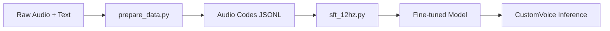

# Qwen3-TTS GD 스타일 Fine-Tuning 연구 보고서

> **작성일**: 2026-03-01
> **목적**: Davinci Voice 모델을 GD(지드래곤) 스타일로 튜닝하기 위한 기술 연구

---

## 1. 현재 시스템 분석

### 1.1 Davinci Voice 아키텍처

```
DavinciVoiceModel (래퍼)
    └── Qwen3TTSModel (실제 구현)
        ├── Qwen3TTSForConditionalGeneration (LLM)
        ├── Speech Tokenizer (VQ-VAE 코덱)
        └── Speaker Encoder (x-vector)
```

**사용 중인 모델:**
- Base: `Qwen/Qwen3-TTS-12Hz-1.7B-Base`
- VoiceDesign: `Qwen/Qwen3-TTS-12Hz-1.7B-VoiceDesign`

### 1.2 현재 Voice Cloning 방식

| 모드 | 설명 | 품질 | 속도 |
|------|------|------|------|
| **x_vector_only** | 스피커 임베딩만 사용 | 중간 | 빠름 |
| **ICL Mode** | 레퍼런스 텍스트 + 오디오 코드 | 높음 | 느림 |
| **Hybrid** | VoiceDesign + Clone 결합 | 높음 | 느림 |

### 1.3 현재 GD 샘플 현황 (수정됨 - 2026-03-01)

| 파일 | 길이 | 용량 | 상태 |
|------|------|------|------|
| `On0m-gdDVCQ.wav` | **10분 53초** | 120MB | ✅ 주요 샘플 |
| `SPEAKER_02.wav` | **5분 37초** | 57MB | ✅ 추출 GD |
| `tKsj0bRLjVk.wav` | 60초 | 12MB | ✅ 사용 가능 |
| `IQatsIl4lEI.wav` | 59초 | 11MB | ✅ 사용 가능 |
| `wjJh4QXCRYo.wav` | 52초 | 9.6MB | ✅ 사용 가능 |
| `u-iNAe4T-NI.wav` | 44초 | 8MB | ✅ 사용 가능 |
| `SPEAKER_02_30s.wav` | 30초 | 1.4MB | ✅ 레퍼런스 후보 |
| `vK9M2D8O05k.wav` | 28초 | 5.1MB | ✅ 사용 가능 |
| `a4vS9eUNnRY.wav` | 27초 | 4.9MB | ✅ 사용 가능 |
| `tWxCKrXI65Y.wav` | 24초 | 4.5MB | ✅ 사용 가능 |
| `kf9yT7Aa1RY.wav` | 15초 | 2.9MB | ✅ 사용 가능 |
| `gd_interview.wav` | 10초 | 472KB | ✅ 깨끗한 샘플 |
| `gd_short.wav` | 10초 | 472KB | ✅ 깨끗한 샘플 |
| `SPEAKER_02_10s.wav` | 10초 | 472KB | ✅ 깨끗한 샘플 |

**총 샘플 길이**: **22.7분 (1,360초)** ✅ Fine-tuning 충분!

---

## 2. Qwen3-TTS Fine-Tuning 연구 결과

### 2.1 공식 Fine-Tuning 지원 확인

Qwen3-TTS GitHub 레포지토리 `finetuning/` 폴더에서 공식 fine-tuning 파이프라인 발견:

```
finetuning/
├── README.md          # 문서
├── prepare_data.py    # 오디오 코드 추출
├── sft_12hz.py        # Supervised Fine-Tuning
└── dataset.py         # 데이터셋 핸들링
```

### 2.2 Fine-Tuning 워크플로우



### 2.3 데이터 형식 요구사항

**입력 JSONL 형식:**
```json
{
  "audio": "./data/gd_001.wav",
  "text": "안녕하세요, 지드래곤입니다.",
  "ref_audio": "./data/gd_ref.wav"
}
```

**오디오 요구사항:**
- Sample Rate: 24,000 Hz
- Channels: Mono
- Format: WAV (PCM 16-bit)
- Duration: 5-15초/청크 권장

### 2.4 훈련 파라미터

```bash
python sft_12hz.py \
  --init_model_path Qwen/Qwen3-TTS-12Hz-1.7B-Base \
  --output_model_path ./models/gd-voice \
  --train_jsonl gd_train_codes.jsonl \
  --batch_size 2 \
  --lr 2e-5 \
  --num_epochs 10 \
  --speaker_name gd
```

| 파라미터 | 권장값 | 설명 |
|----------|--------|------|
| batch_size | 2-4 | VRAM 16GB 기준 |
| lr | 2e-5 ~ 2e-6 | 학습률 |
| num_epochs | 5-10 | 에폭 수 |
| speaker_name | "gd" | 스피커 식별자 |

### 2.5 추론 방식 (Fine-tuned 모델)

```python
from qwen_tts import Qwen3TTSModel

model = Qwen3TTSModel.from_pretrained(
    "./models/gd-voice/checkpoint-epoch-5",
    device_map="cuda:0",
    dtype=torch.bfloat16,
)

# CustomVoice 모드로 추론
wavs, sr = model.generate_custom_voice(
    text="안녕하세요",
    speaker="gd",  # Fine-tuning 시 지정한 speaker_name
)
```

---

## 3. GD 스타일 튜닝 전략

### 3.1 전략 비교

| 전략 | 데이터 요구량 | 소요 시간 | 품질 | 난이도 |
|------|---------------|-----------|------|--------|
| ICL Mode 최적화 | 10-30초 | 즉시 | 중간 | 낮음 |
| VoiceDesign Hybrid | 10-30초 | 즉시 | 중-상 | 낮음 |
| **Full Fine-Tuning** | **5분+** | **3-5일** | **최상** | **중간** |
| LoRA Fine-Tuning | 5분+ | 1-2일 | 상 | 중간 |

### 3.2 권장 전략: Full Fine-Tuning

**이유:**
1. 공식 지원 파이프라인 존재
2. CustomVoice 모드로 안정적 추론
3. 말투, 운율, 발음 패턴 학습 가능
4. 일관된 품질 보장

### 3.3 데이터 현황 (충분!)

**현재**: 22.7분 (1,360초) ✅
**최소 요구**: 5분 → **454% 충족**
**권장**: 30분 → **76% 충족**

**현재 샘플로 Fine-Tuning 즉시 가능!**

추가 수집 시 품질 기준:
- 배경 노이즈 최소
- 단일 화자
- 명확한 발음
- 다양한 감정/톤 포함

---

## 4. 실행 계획

### Phase 1: 데이터 준비 (1-2일)

```bash
# 1. 오디오 수집 및 정리
mkdir -p data/gd_raw

# 2. 포맷 변환 (24kHz mono)
ffmpeg -i input.wav -ar 24000 -ac 1 data/gd_raw/output.wav

# 3. Whisper 전사
python -c "
import whisper
model = whisper.load_model('large-v3')
result = model.transcribe('data/gd_raw/sample.wav', language='ko')
print(result['text'])
"

# 4. JSONL 생성
python scripts/prepare_gd_dataset.py
```

### Phase 2: Fine-Tuning (1-2일)

```bash
cd /path/to/Qwen3-TTS/finetuning

# 1. 오디오 코드 추출
python prepare_data.py \
  --device cuda:0 \
  --tokenizer_model_path Qwen/Qwen3-TTS-Tokenizer-12Hz \
  --input_jsonl /path/to/gd_train.jsonl \
  --output_jsonl gd_train_codes.jsonl

# 2. Fine-Tuning 실행
python sft_12hz.py \
  --init_model_path Qwen/Qwen3-TTS-12Hz-1.7B-Base \
  --output_model_path /home/nexus/connect/server/models/gd-voice \
  --train_jsonl gd_train_codes.jsonl \
  --batch_size 2 \
  --lr 2e-5 \
  --num_epochs 10 \
  --speaker_name gd
```

### Phase 3: 통합 (1일)

1. Fine-tuned 모델 로딩 로직 추가
2. `voice_manager.py` 업데이트
3. `tts_engine.py`에 CustomVoice 모드 추가
4. API 엔드포인트 확장

---

## 5. 즉시 적용 가능한 개선사항

### 5.1 ICL Mode 활성화

현재 `x_vector_only_mode=True` → `False`로 변경:

```python
# voice_manager.py 수정
def cache_prompt(self, ...):
    prompt = model.create_voice_clone_prompt(
        ref_audio=voice.sample_path,
        ref_text=voice.ref_text,  # 트랜스크립트 필수
        x_vector_only_mode=False,  # ICL 모드 활성화
    )
```

### 5.2 생성 파라미터 최적화

```python
# config.py에 GD 프리셋 추가
GD_VOICE_PRESET = {
    "temperature": 0.75,
    "top_k": 40,
    "top_p": 0.9,
    "repetition_penalty": 1.15,
}
```

### 5.3 레퍼런스 오디오 개선

가장 깨끗한 30초 샘플을 레퍼런스로 사용:
```bash
# SPEAKER_02_30s.wav를 기본 레퍼런스로 설정
cp sample/SPEAKER_02_30s.wav tts_server/data/voices/gd_ref.wav
```

---

## 6. 참고 자료

### 공식 문서
- [Qwen3-TTS GitHub](https://github.com/QwenLM/Qwen3-TTS)
- [HuggingFace Model Card](https://huggingface.co/Qwen/Qwen3-TTS-12Hz-1.7B-Base)
- [Qwen-TTS PyPI](https://pypi.org/project/qwen-tts/)

### Fine-Tuning 스크립트
- `finetuning/prepare_data.py`: 오디오 코드 추출
- `finetuning/sft_12hz.py`: SFT 훈련 스크립트
- `finetuning/dataset.py`: 데이터셋 클래스

---

## 7. 결론

Qwen3-TTS는 공식적으로 fine-tuning을 지원하며, GD 스타일 튜닝은 충분한 데이터(5분+)와 함께
**Full Fine-Tuning** 전략으로 가장 좋은 결과를 얻을 수 있습니다.

즉시 적용 가능한 개선으로는 **ICL Mode 활성화**와 **생성 파라미터 최적화**가 있으며,
이를 통해 현재 샘플만으로도 품질 향상을 기대할 수 있습니다.

---

*연구 수행: Claude Opus 4.6 | 2026-03-01*
